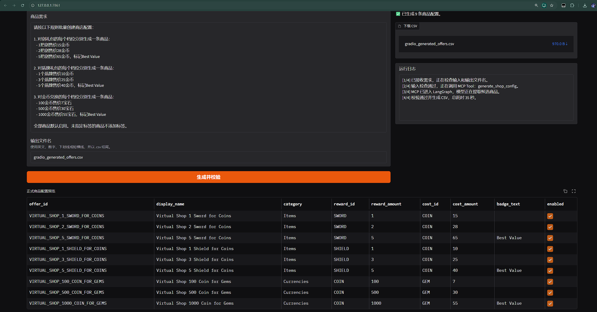
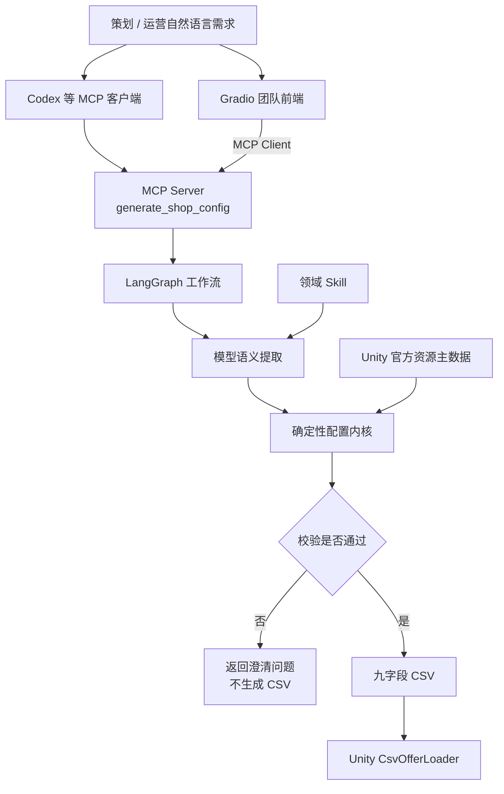
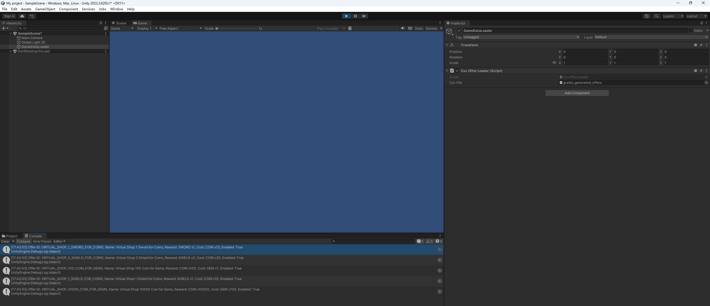

# Unity 游戏商店配置 Agent

一个面向 Unity 游戏团队的 AI 配置生成原型：把策划的自然语言商品需求转换为经过主数据约束和业务校验的九字段 CSV，并通过 MCP、Gradio 与 Unity 完成可演示闭环。



## 项目解决什么问题

游戏策划和运营经常需要把文字需求转换为结构化配置。例如：

> 创建三个商品：一把剑售价 15 金币；三个盾牌售价 20 金币并标记 Best Value；100 金币售价 7 宝石。

如果直接让大模型写 CSV，可能出现资源 ID 被编造、奖励与价格方向混淆、字段缺失或格式不稳定等问题。本项目采用“模型理解语义、代码保证正确性”的方式：

- 模型只提取候选商品；
- Skill 约束游戏商店领域语义；
- 确定性代码查询资源主数据、生成 ID、应用默认值并校验；
- LangGraph 控制“生成”与“澄清”分支；
- 只有全部校验通过时才导出正式 CSV。

## 已实现能力

- 支持中文自然语言输入和多条商品批量生成；
- 识别奖励物品、数量、价格、货币和 `Best Value` 标签；
- 使用 Unity 官方 Virtual Shop 示例资源作为固定主数据；
- 自动生成稳定的 `offer_id`、分类和展示名称；
- 显式记录默认数量、启用状态和空标签等默认值；
- 未知资源、缺少货币、非法数值和重复 ID 会阻止导出；
- 支持命令行、Codex MCP 和 Gradio 三种使用入口；
- Gradio 显示运行阶段、等待时间、正式表格、校验详情和 CSV 下载；
- Agent 生成的多条 CSV 已在 Unity 中完成实际解析验证；
- 当前包含 19 项自动化测试。

## 系统架构



当前 Gradio 为了保持 MVP 部署简单，使用同进程 MCP Client 调用 MCP Tool；Codex 则通过本地 STDIO MCP Server 调用同一工具。未来可以把传输替换为 Streamable HTTP，而不改变领域核心。

## 技术组件分工

| 组件 | 解决的问题 |
|---|---|
| **Skill** | 封装游戏商店字段语义、提取规则、正反例和安全约束 |
| **LangGraph** | 管理提取、构建、校验以及生成/澄清条件分支 |
| **Pydantic** | 定义候选数据、正式配置、错误和默认值的数据契约 |
| **ResourceCatalog** | 查询可信资源 ID、类型、英文名称和中文别名 |
| **确定性工具** | 生成 ID、推断分类、应用默认值、校验并导出 CSV |
| **MCP** | 将完整 Agent 封装成可被兼容客户端发现和调用的标准工具 |
| **Gradio** | 为非技术成员提供输入、日志、预览和下载界面 |
| **Unity/C#** | 验证生成的 CSV 能被目标游戏引擎正确消费 |

## LangGraph 工作流

```text
extract
  模型结合 Skill，将自然语言提取为 CandidateOffer 列表
    ↓
build
  查询主数据、应用默认值、生成 ID、执行确定性校验
    ↓
是否存在错误？
    ├─ 是 → clarify：返回结构化错误和补充问题，不生成 CSV
    └─ 否 → export：生成固定九字段 CSV
```

LangGraph 在这里不是为了增加节点数量，而是为了把“未经校验的数据不能导出”实现成明确、可测试的流程约束。

## 九字段 CSV 契约

| 字段 | 含义 | 示例 |
|---|---|---|
| `offer_id` | 售卖项唯一 ID | `VIRTUAL_SHOP_1_SWORD_FOR_COINS` |
| `display_name` | 人类可读名称 | `Virtual Shop 1 Sword for Coins` |
| `category` | 商品分类 | `Items` |
| `reward_id` | 玩家获得的资源 ID | `SWORD` |
| `reward_amount` | 玩家获得数量 | `1` |
| `cost_id` | 玩家消耗的货币 ID | `COIN` |
| `cost_amount` | 玩家消耗数量 | `15` |
| `badge_text` | 可选展示标签 | `Best Value` |
| `enabled` | 是否启用 | `true` |

当前固定主数据包括：`COIN`、`GEM`、`PEARL`、`STAR`、`SWORD` 和 `SHIELD`。中文别名只用于查询，不会创建主数据中不存在的资源。

## 快速开始

### 1. 创建环境

需要 Python 3.11 或更高版本。

```powershell
git clone https://github.com/LogicPaw/Unity-Gameshop-Agent.git
cd Unity-Gameshop-Agent
python -m venv .venv
& .\.venv\Scripts\python.exe -m pip install -e .
```

### 2. 配置模型

复制配置模板：

```powershell
Copy-Item .env.example .env
```

填写 OpenAI Chat Completions 兼容接口：

```text
OPENCODEGO_API_KEY=你的密钥
OPENCODEGO_BASE_URL=https://opencode.ai/zen/go/v1
OPENCODEGO_MODEL=kimi-k2.6
```

`.env` 已加入 `.gitignore`，不要将真实密钥提交到仓库。

### 3. 启动 Gradio

```powershell
& .\.venv\Scripts\game-config-ui.exe
```

浏览器会自动打开本地页面，默认地址通常为：

```text
http://127.0.0.1:7860
```

生成文件由 MCP Server 统一写入 `outputs/mcp/`。停止服务时在终端按 `Ctrl+C`。

### 4. 直接运行 LangGraph Agent

```powershell
& .\.venv\Scripts\game-config-agent.exe `
  "创建三个商品：一把剑售价15金币；三个盾牌售价20金币并标记Best Value；100金币售价7宝石。" `
  --output outputs\agent_generated_offers.csv
```

### 5. 在 Codex 中注册 MCP

将下面路径替换为你克隆项目后的绝对路径：

```powershell
codex mcp add unity-shop-config -- "C:\绝对路径\.venv\Scripts\game-config-mcp.exe"
codex mcp list
```

重启 Codex 后，可以直接要求它调用 `generate_shop_config`。

## 推荐测试输入

### 正常批量路径

```text
创建三个商品：一把剑售价15金币；三个盾牌售价20金币并标记Best Value；100金币售价7宝石。全部商品默认启用。
```

预期结果：生成三条正式配置，并记录默认启用状态和空标签。

### 异常路径

```text
创建两个商品：水晶剑售价200宝石；一把剑售价15。
```

预期结果：返回 `UNKNOWN_REWARD` 和 `MISSING_CURRENCY`，不生成正式 CSV。

### 九条批量路径

可以分别为剑、盾牌和金币兑换提供多个档位。该测试会验证模型的批量展开能力、ID 唯一性、标签和货币方向。较慢的模型服务可能需要更长响应时间，Gradio 会持续显示等待日志。

## 测试

运行全部测试：

```powershell
& .\.venv\Scripts\python.exe -m unittest discover -s tests -v
```

当前 19 项测试覆盖三层：

- **领域层**：主数据、别名、默认值、数值、资源类型、重复 ID 和 CSV Schema；
- **集成层**：LangGraph 条件分支、MCP 工具发现/调用、Gradio → MCP 调用链；
- **人工验收层**：Codex MCP、Gradio 页面和 Unity 运行时解析。

## Unity 验证

项目先用一行人工 CSV 验证 Unity 格式，再将 Agent/Gradio 生成的多条商品放入 Unity，由轻量 C# `CsvOfferLoader` 读取，并在 Console 中检查：

- `offer_id`；
- 奖励 ID 和数量；
- 货币 ID 和价格；
- 启用状态。



最小 Unity 示例源码已包含 [`CsvOfferLoader.cs`](unity/Assets/Scripts/CsvOfferLoader.cs) 和 [`OfferData.cs`](unity/Assets/Scripts/OfferData.cs)。把两个脚本与生成的 CSV 放入 Unity `Assets`，将 CSV 作为 `TextAsset` 绑定到组件后运行场景即可检查输出。

当前 Unity 部分是输入格式和字段语义验证，不宣称替代具体公司的生产配置管线。这个轻量解析器面向当前受控 CSV Schema，不处理带逗号的复杂转义字段。详细验收过程见 [`docs/UNITY_CSV_SMOKE_TEST.md`](docs/UNITY_CSV_SMOKE_TEST.md)。

## 项目结构

```text
├─ data/
│  ├─ raw/                     Unity 官方数据固定快照
│  ├─ reference/               中文资源别名
│  └─ examples/                输入、预期输出与 Unity CSV 示例
├─ docs/                       设计、验收与项目过程文档
├─ skills/unity-virtual-shop-config/
│                               游戏商店领域 Skill
├─ unity/Assets/Scripts/        Unity 最小 CSV 解析示例
├─ src/game_config_agent/
│  ├─ models.py                数据契约
│  ├─ catalog.py               主数据查询
│  ├─ tools.py                 确定性校验与导出
│  ├─ agent.py                 LangGraph 工作流
│  ├─ mcp_server.py            MCP Server
│  └─ gradio_app.py            Gradio MCP Client
├─ tests/                      自动化测试
├─ PROJECT_PLAN.md             项目全过程、决策与取舍
└─ pyproject.toml              依赖和运行入口
```

## Vibe Coding 方法

本项目采用“小步实现 → 独立测试 → 人工理解 → 发现偏差 → 调整架构 → 回归验证”的 AI 辅助开发方式。

开发者负责：

- 需求分析与场景收敛；
- 阶段拆分和验收标准；
- 数据契约与架构边界；
- 正常/异常测试设计；
- Unity 实际验证；
- 对低收益需求做取舍。

AI 负责加速初始实现、测试补充、问题定位和文档整理。一个实际例子是：Gradio 初版准备直接调用 LangGraph，架构复核后调整为通过 MCP Client 调用统一 MCP Tool，并新增测试证明前端没有绕过 MCP。

完整开发过程与决策记录见 [`PROJECT_PLAN.md`](PROJECT_PLAN.md)。

## 设计取舍

- **为什么不让模型直接写 CSV？** 正式 ID、类型、数值和文件格式需要可重复的确定性保证。
- **为什么使用 LangGraph？** 为正常导出和异常澄清建立显式条件分支。
- **为什么 Gradio 经过 MCP？** 让 Codex 和传统 Web 前端复用相同公开契约。
- **为什么没有自动提交 SVN？** 人工下载后仍需要业务复核和修改；自动提交会增加权限、冲突和误提交风险，但当前收益有限。
- **为什么没有并发和多 Agent？** MVP 更重视正确性、可解释性和端到端验证，而不是吞吐量。

## 当前边界与后续方向

当前版本：

- 只支持 Unity Virtual Shop 九字段配置；
- 使用固定资源主数据；
- 澄清后需要重新提交完整需求；
- Gradio 运行在本地单机；
- 不包含自动 SVN 提交和生产权限系统。

如果进入团队生产化，可继续扩展：

- 公司真实物品表或数据库主数据；
- 多配置模板和字段级权限；
- LangGraph checkpoint 与澄清恢复；
- Streamable HTTP MCP、身份验证与审计；
- 任务队列、并发和批量评测；
- Unity Editor 正式导入器和项目侧校验报告。

## 数据来源

测试主数据来自 Unity Technologies 公开的 Unity Gaming Services Use Cases / Virtual Shop 示例。仓库内保存固定快照和来源说明，详见 [`data/raw/unity_virtual_shop/SOURCE.md`](data/raw/unity_virtual_shop/SOURCE.md)。
